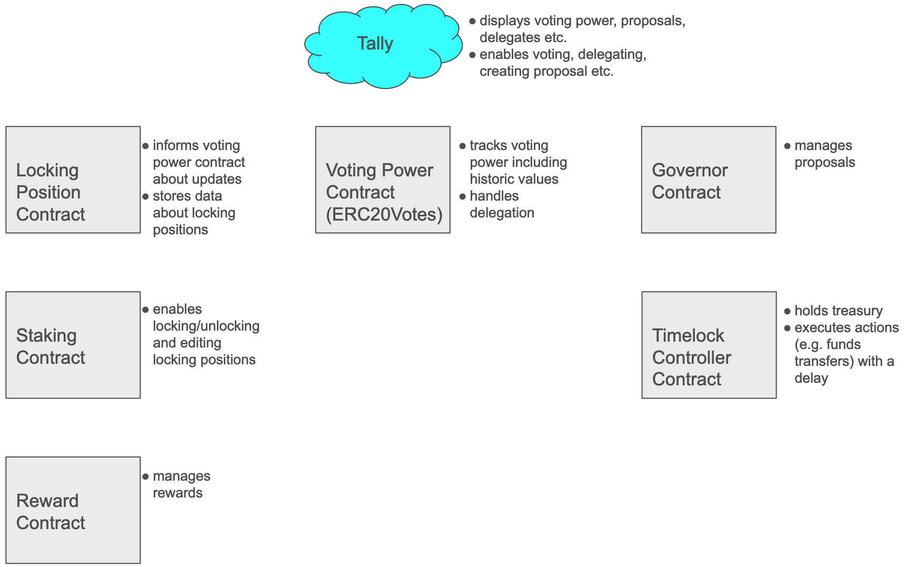
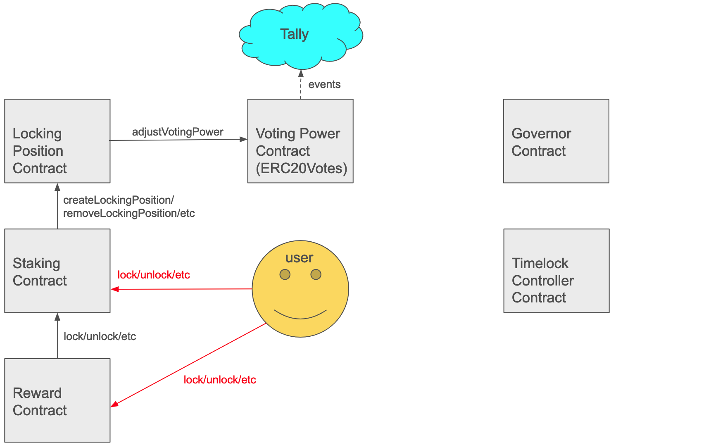
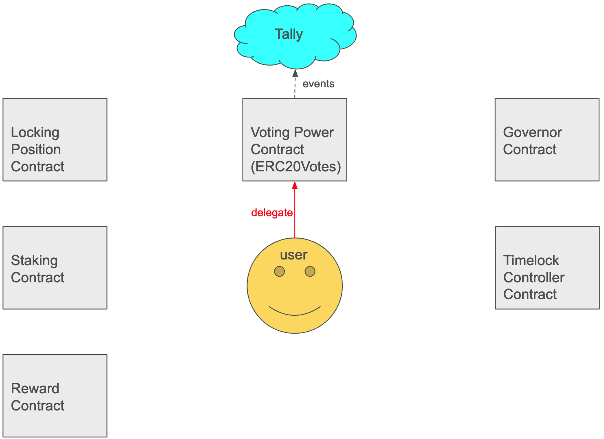
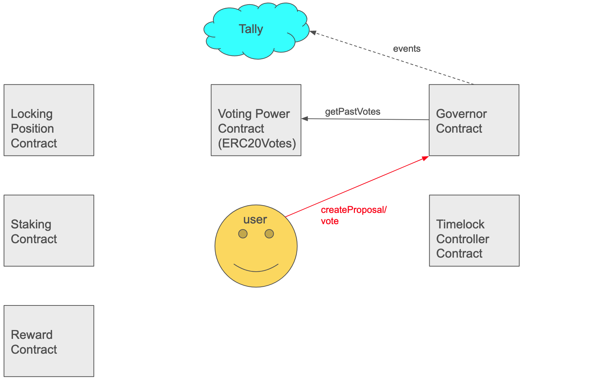
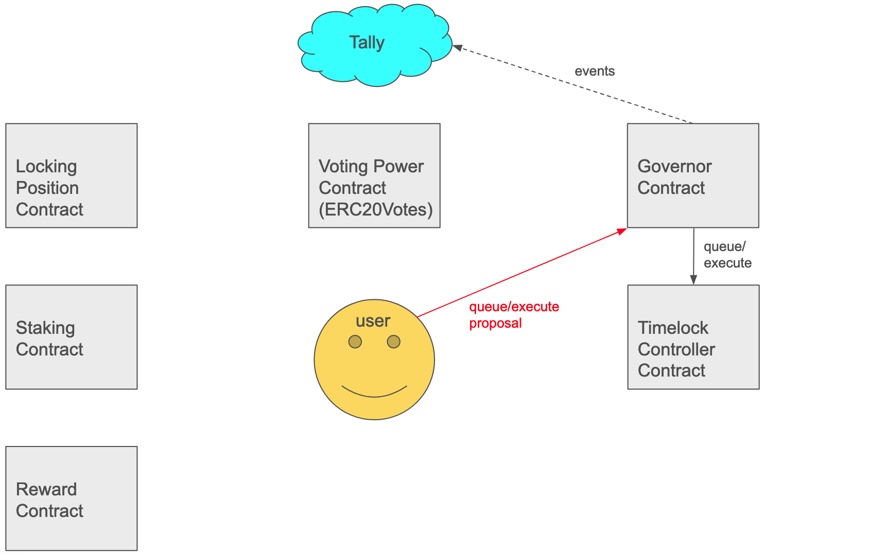

# Staking and Lisk DAO

## Overview

In general, staking and governance in Lisk is inspired by the veToken Model and [this staking proposal for the Arbitrum DAO](https://snapshot.org/#/arbitrumfoundation.eth/proposal/0xf22530295daee96dffd7f70854475c06216a4d3594929672f71c12bf638bb0c8). The basic idea is that token holders have the option to lock their tokens in Lisk for a duration between 2 weeks and 2 years in return for:

- **voting power** depending on the locked amount with the option of a boost for longer paused unlocking countdown.
- **staking rewards** depending on the locked amount and locking duration.

This design with selectable locking duration helps to align token holders with the long term success of the Lisk project.

## Locking Mechanism

The mechanism for locking tokens works as follows: 

- Users can **lock** tokens for a specific locking duration (between 2 weeks and 2 years). After the locking duration ends, the users can unlock their tokens.
- Users can **modify** their locking positions (increase amount, extend locking duration) at any time.
- Users have the option to **pause** their locking period countdown. That means, the remaining locking duration remains fixed until the user decides to resume it. Note that this results in higher voting power and staking rewards as [described below](#pausing-a-locking-position). 
- Each user may have multiple locking positions. 
- Locking positions are represented using **NFTs** for composability into DeFi and potential future uses. 
- In case a user wants to unlock earlier than the end of the locking duration, there is a **fast unlock** option. The fast unlock implies a penalty, i.e., an amount that is deducted from the locked LSK tokens. The penalty is set to `0.5 * lockedAmount *  (remainingLockingDurationInDays / maximumLockingDuration)`, where `maximumLockingDuration` is set to 2 years. Users can then unlock their tokens after a 3-day emergency locking period.
  - Confiscated tokens are immediately redirected to the staking rewards pool to be distributed over the next 14 days period on top of the guaranteed rewards.
  - Users do not have the option to cancel the fast unlock during this 3 day window.

## Voting Power

The voting power of an account is expressed by the account's balance of another ERC20 contract, the *Voting Power* contract. The token symbol of this contract `vpLSK`. The voting power for a locked amount of tokens is computed as follows:

- Generally, locked tokens provide a voting power proportional to the amount of locked tokens. Concretely, 1 locked LSK provides 1 vpLSK.
- In case a user pauses their locking period countdown, they receive a boost of the voting power meaning the voting power is set to `lockedAmount * (1 + remainingLockingDurationInDays/365)`. Hence, the voting power can be increased by up to 200% by pausing a locking position with the maximum locking period of 2 years.

### Voting Power for a Concrete Proposal

At the time a proposal is created, a snapshot of the delegated voting power is taken and the voting result is based on this snapshot. Consequently, neither any changes in the voting power nor any delegations made after the proposal creation have any influence on the voting result.

## Staking Rewards

Users receive rewards for locking their tokens as follows: 

- Rewards are calculated on a daily basis, based on the amount locked and the remaining locking duration. Concretely, the weight for a locked amount is given by `lockedAmount * (remainingLockingDurationInDays + 150)`. The total daily amount of staking rewards is then shared by all users proportional to their weight. That means, a position with weight `w` receives `totalDailyRewards * w / totalWeight`.
- Users can claim their rewards (and restake them immediately if they want) at any time.

## Pausing a Locking Position

As mentioned in several places above, it is possible *to pause* the countdown of a locking position. This can be done at any time. Once paused, the remaining locking duration does not decrease anymore. The owner of the locking position can *resume* the countdown of the locking period an any point in time. Once resumed, the remaining locking duration descreases again daily.

**Example**: A users creates a locking position on day 1 and with a locking duration of 30 days. On day 6, the remaining locking duration is 25 days. On the same day, the user pauses the locking pausition. On day 50, the remaining locking duration is still 25. The users resumes the countdown of the locking position on this day. On day 75, the reamining locking duration is zero and the user can unlock their tokens.

What are the consequences of pausing the countdown:

- The voting power is boosted, i.e. increased from `lockedAmount` to `lockedAmount * (1 + remainingLockingDurationInDays/365)`.
- The weight on the rewards calculation (`lockedAmount * (remainingLockingDurationInDays + 150)`) does not decrease daily (in contrast to unpaused locking positions) but remains fixed for the duration that the position remains paused. This results in higher staking rewards.
- The locking position does not expire.

## Onchain Governance

The main aspects of our onchain governance system are as follows:

- We use OpenZeppelin’s Governor contract framework and also manage the Lisk DAO treasury with it. 
- The following parameters are used:
  - **Proposal threshold**: For creating a proposal, the voting power of the proposer must be at least 300,000 vpLSK, i.e., the value corresponding to 100,000 LSK locked for 2 years where the countdown is paused.
  - **Quorum**: For a proposal to pass, the “yes” and “abstain” votes must sum up at least to 24,000,000 vpLSK, i.e., the value that corresponds to 8,000,000 LSK locked for 2 years where the countdown is paused.
- A proposal is accepted if the quorum, as defined above, is reached, and if there are strictly more “yes” than “no” votes.
- The onchain governance allows the following two proposal types:
  - **Funding proposals**: A proposal for receiving a certain amount of funds to an address. If passed, the recipient receives the amount given in the proposal. 
  - **General proposal**: Generic proposals about protocol parameters or the project direction in general. 
- For the UI, we integrate with Tally. In particular, users will be able to delegate their tokens to delegates who can vote on their behalf.

## Contracts Overview

The graphic above shows all contracts involved in the staking and governance system and their responsibilities. Additionally, Tally is show which serves as the front end for governance.

### User Interaction

#### Locking/Unlocking

There are two ways how the user can lock/unlock/modify a staking position. In the first one, the user calls the Staking contract. The Staking contract will create/delete/modify a locking position in the Locking Position Contract which in turn forwards a call to the Voting Power Contract to adjust the voting power of the owner of the locking position. The Voting Power contract will emit events which will be used by Tally for indexing. For locking positions created like this, the user will not receive any rewards.

In the second way, the user calls the Reward contract. The Reward contract will call lock/unlock/modify in the Staking contract, which will trigger the same forwarded calls as in the first way. The difference is that the user will receive rewards for locking positions create this way.

#### Delegating

For delegating, the user is interacting with the Voting Power contract directly. The Voting Power contract will emit events which will be used by Tally for indexing.

#### Creating Proposals and Voting

For creating a proposal or voting on a proposal, the user is interacting with the Governor contract. The Governor contract will request the voting power of the proposer/voter in order to see if the user has enough voting power to create a proposal or for counting the voting results. Moreover, the Governor contract will emit events which will be used by Tally for indexing.

#### Queueing and Executing Proposals

If a proposal has an attached execution, e.g. a transfer of some treasury funds, and the proposal passed, then the proposal must be queued and then executed. For this, a user (this can be any user) must interact with the Governor contract. This one is forwarding the queue/execute operation to the Timelock Controller contract, and the Governor contract additionally emits events which Tally uses for indexing. The Governor contract is the only account that is allowed to queue proposals at the Timelock Controller. As all executions are eventually executed by the Timelock Controller, contracts owned by the Lisk DAO must be owned by the Timelock Controller, and the DAO treasury must be held by it as well.

### Implementation of Lisk Staking

For details about the implementation of the staking sytem, see the [Lisk Staking implementation page](./staking-implementation.md)