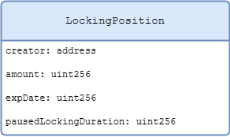
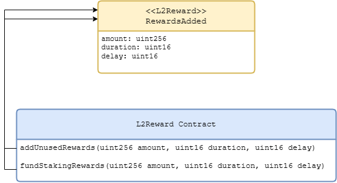
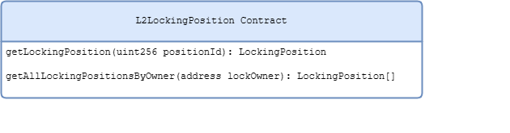

# Staking and Lisk DAO

## Overview

In general, staking and governance in Lisk is inspired by the veToken Model and [this staking proposal for the Arbitrum DAO](https://snapshot.org/#/arbitrumfoundation.eth/proposal/0xf22530295daee96dffd7f70854475c06216a4d3594929672f71c12bf638bb0c8). The basic idea is that token holders have the option to lock their tokens in Lisk for a duration between 2 weeks and 2 years in return for:

- **voting power** depending on the locked amount with the option of a boost for longer paused unlocking countdown.
- **staking rewards** depending on the locked amount and locking duration.

This design with selectable locking duration helps to align token holders with the long term success of the Lisk project.

## Locking Mechanism

The mechanism for locking tokens works as follows: 

- Users can lock tokens for a specific locking duration (between 2 weeks and 2 years). After the locking duration ends, the users can redeem their tokens.
- Users can modify their locking positions (increase amount, extend locking duration) at any time.
- Users have the option to pause their locking period countdown. That means, the remaining locking duration remains fixed until the user decides to resume it. Note that this results in higher voting power and staking rewards as described below. 
- Each user may have multiple locking positions. 
- Locking positions are represented using NFTs for composability into DeFi and potential future uses. 
- In case a user wants to unlock earlier than the end of the locking duration, there is a fast unlock option. The fast unlock implies a penalty, i.e., an amount that is deducted from the locked LSK tokens. The penalty is set to `0.5 * lockedAmount *  (remainingLockingDurationInDays / maximumLockingDuration)`, where `maximumLockingDuration` is set to 2 years. Users can then redeem their tokens after a 3-day emergency locking period.
  - Confiscated tokens are immediately redirected to the staking rewards pool to be distributed over the next 14 days period on top of the guaranteed rewards.
  - Users do not have the option to cancel the fast un-stake during this 3 day window.

## Voting Power

The voting power for a locked amount of tokens is computed as follows:

- Generally, locked tokens provide a voting power proportional to the amount of locked tokens. Concretely, 1 locked LSK provides one unit of voting power.
- In case a user pauses their locking period countdown, they receives a boost of the voting power meaning the voting power is set to `lockedAmount * (1 + remainingLockingDurationInDays/365)`. Hence, the voting power can be increased by up to 200%.

## Staking Rewards

Users receive rewards for their locking tokens as follows: 

- Rewards are calculated on a daily basis, based on the amount locked and the remaining locking duration. Concretely, the weight for a locked amount is given by `lockedAmount * (remainingLockingDurationInDays + 150)`. The total daily amount of staking rewards is then shared by all users proportional to their weight.
- Users can claim their rewards (and restake them immediately if they want) at any time.   

## Onchain Governance

The main aspects of our onchain governance system are planned as follows:

- We use OpenZeppelin’s Governor contract framework and also manage the Lisk DAO treasury with it. 
- The following parameters are used:
  - **Proposal threshold**: For creating a proposal, the voting power of the proposer must be at least 300,000, i.e., the value corresponding to 100,000 LSK locked for 2 years where the countdown is paused.
  - **Quorum**: For a proposal to pass, the “yes” and “abstain” votes must sum up at least to 22,500,000, i.e., the value that corresponds to 7,500,000 LSK locked for 2 years where the countdown is paused. 
- A proposal is accepted if the quorum, as defined above, is reached, and if there are strictly more “yes” than “no” votes.
- The onchain governance allows the following two proposal types:
  - **Funding proposals**: A proposal for receiving a certain amount of funds to an address. If passed, the recipient receives the amount given in the proposal. 
  - **General proposal**: Generic proposals about protocol parameters or the project direction in general. 
- For the UI, we integrate with Tally. In particular, users will be able to delegate their tokens to delegates who can vote on their behalf.

## Contracts Overview

The graphic above shows all contracts involved in the staking and governance system and their responsibilities. Additionally, Tally is show which serves as the front end for governance.

### User Interaction

### Locking/Unlocking

There are two ways how the user can lock/unlock/modify a staking position. In the first one, the user calls the Staking contract. The Staking contract will create/delete/modify a locking position in the Locking Position Contract which in turn forwards a call to the Voting Power Contract to adjust the voting power of the owner of the locking position. The Voting Power contract will emit events which will be used by Tally for indexing. For locking positions created like this, the user will not receive any rewards.

In the second way, the user calls the Reward contract. The Reward contract will call lock/unlock/modify in the Staking contract, which will trigger the same forwarded calls as in the first way. The difference is that the user will receive rewards for locking positions create this way.

### Delegating

For delegating, the user is interacting with the Voting Power contract directly. The Voting Power contract will emit events which will be used by Tally for indexing.

### Creating Proposals and Voting

For creating a proposal or voting on a proposal, the user is interacting with the Governor contract. The Governor contract will request the voting power of the proposer/voter in order to see if the user has enough voting power to create a proposal or for counting the voting results. Moreover, the Governor contract will emit events which will be used by Tally for indexing.

### Queueing and Executing Proposals

If a proposal has an attached execution, e.g. a transfer of some treasury funds, and the proposal passed, then the proposal must be queued and then executed. For this, a user (this can be any user) must interact with the Governor contract. This one is forwarding the queue/execute operation to the Timelock Controller contract, and the Governor contract additionally emits events which Tally uses for indexing. The Governor contract is the only account that is allowed to queue proposals at the Timelock Controller. As all executions are eventually executed by the Timelock Controller, contracts owned by the Lisk DAO must be owned by the Timelock Controller, and the DAO treasury must be held by it as well.

## Implementation

Implementation of L2 staking functionality is separated into,

- `L2LockingPosition` contract maintains locking positions and allows owner to manipulate their positions. The contract is an implementation of ERC721 based NFT and interacts with L2VotingPower contract to adjust the voting power of the owner of the locking position when consumed by L2Staking contract.

- `L2Staking` contract manages and controls access to core staking functionality allowing, “Creators” to lock amount and manipulate them, when interacted upon by `L2Reward` contract driven by end-user interactions. The contract consumes `L2LockingPosition` to modify locking positions and the relevant voting power of their owner.

- `L2Reward` contract exposes the public interface to end-user enabling them to create and modify their locking positions and interacts with `L2Staking` contract by mirroring its API to interact with entire set of functionalities enabling users to create and manipulate their locking positions and as a result claim rewards and impact their voting power.

- `L2VotingPower` is an implementation of `ERC20` token standard that maintains the voting power of an account.

## Structure of a Locking position
Locking position (or a stake) is represented as a custom data structure containing:

| Property              | Type      | Description                                                                                                                                                                                        |
| --------------------- | --------- | -------------------------------------------------------------------------------------------------------------------------------------------------------------------------------------------------- |
| creator               | `address` | Address of the creator, it could only be one from a set of creators that are added to list of creators of `L2Staking` contract by its owner, typically this is the address of `L2Reward` contract. |
| amount                | `uint256` | Amount to be locked.                                                                                                                                                                               |
| expDate               | `uint256` | Duration in days for which the amount is locked.                                                                                                                                                   |
| pausedLockingDuration | `uint256` | Remaining duration in days till the expiry date when the locking position is paused. It is set to zero if the locking position is not paused.                                                      |

## Identifying a Locking Position
`L2LockingPositioncontract` maintain a collection of locking positions against each user and uniquely identify them with an identifier of type `uint256`.

## L2Reward Contract
### Events emitted on interactions
`L2Reward` communicates changes to state made by the contract or other contracts it consumes through events:

| Contract            | Event                     | Description                                                                                                                             |
| ------------------- | ------------------------- | --------------------------------------------------------------------------------------------------------------------------------------- |
| `L2Reward`          | `RewardsAdded`            | Emitted when the owner of L2Reward add funds available for rewarding lockingpositions.                                                  |
| `L2Reward`          | `RewardsClaimed`          | Emitted when an external account claims rewards or other manipulations on locking positions are made.                                   |
| `L2LockingPosition` | `LockingPositionCreated`  | Emitted when an external account creates a locking position.                                                                            |
| `L2LockingPosition` | `LockingPositionModified` | Emitted when an external account modifies a locking position.                                                                           |
| `L2LockingPosition` | `Transfer`                | Emitted when an external account creates a locking position.                                                                            |
| `L2VotingPower`     | `Transfer`                | Emitted when external account creates or modifies a locking position, the amount locked by an account impacts its owner's voting power. |

### API accessible to external user and Events
The diagram highlights the public API accessible to external account and how creation and manipulations of locking positions consumes other smart contracts and the relevant events that are emitted.

### API accessible to the owner of L2Reward contract and Events
L2Reward contract is ownable and allows contract owner to manipulate funds for rewarding locking position. Its owner can allocate add funds and unused rewards accumulated due to reward capping for a certain duration.

## L2LockingPosition Contract

This contract exposes the public API to retrieve information about locking positions against an owner.

# Representing Time

Contracts involved in L2 Lisk staking maintains (UNIX epoch) time at the granularity of a day, instead of seconds.
The day 19740, will be 19740 x 60 x 60 x 24 i.e. 1705536000 epoch seconds, any interactions at other higher-level environment must convert days to epoch time.