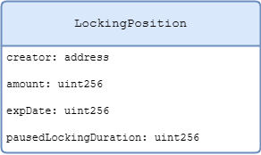
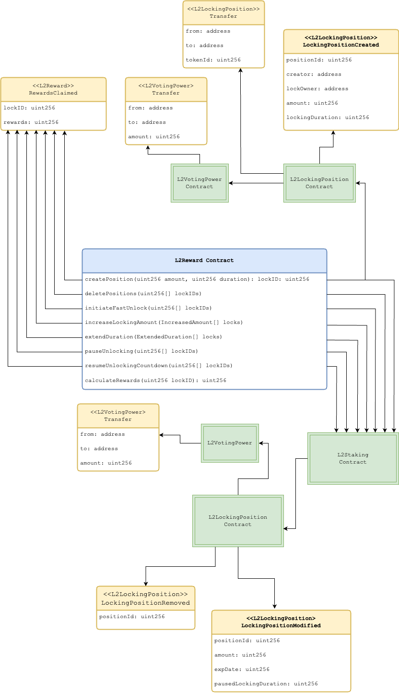
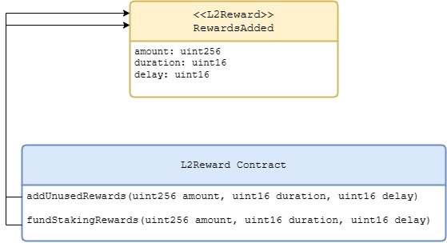
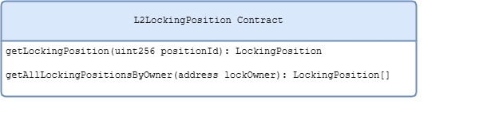

# Staking Implementation

Implementation of L2 staking functionality is separated into,

- `L2LockingPosition` contract maintains locking positions and allows owner to manipulate their positions. The contract is an implementation of ERC721 based NFT and interacts with L2VotingPower contract to adjust the voting power of the owner of the locking position when consumed by `L2Staking` contract.

- `L2Staking` contract manages and controls access to core staking functionality allowing “creators” to lock amounts and manipulate them. The contract consumes `L2LockingPosition` to modify locking positions and the relevant voting power of their owner.

- `L2Reward` contract interacts with `L2Staking` contract by mirroring its API enabling its users to interact with the entire set of staking functionalities. Moreover, it manages rewards of locking positions, however it only enables rewards and allows manipulation of locking positions created via `L2Reward` contract. Rewards can only be claimed against locking positions created by `L2Reward` not the ones created via `L2Staking` contract.

- `L2VotingPower` contract is an implementation of `ERC20Votes` token standard that maintains the voting power of an account.

## Structure of a Locking position
A locking position (or a stake) is represented as a custom data structure containing:

| Property              | Type      | Description                                                                                                                                                                                                                                                                                                                                                                   |
| --------------------- | --------- | ----------------------------------------------------------------------------------------------------------------------------------------------------------------------------------------------------------------------------------------------------------------------------------------------------------------------------------------------------------------------------- |
| creator               | `address` | Address of the creator, it could only be one from the set of creators that are added to the list of creators of `L2Staking` contract by its owner. This can either be the staking contract or the reward contract, as staking contract is the only contract allowed to modify a position, it uses this property to determine who should be allowed to trigger a modification. |
| amount                | `uint256` | Amount to be locked.                                                                                                                                                                                                                                                                                                                                                          |
| expDate               | `uint256` | The expiration date, i.e., the day when the locked amount becomes claimable for the user.                                                                                                                                                                                                                                                                                     |
| pausedLockingDuration | `uint256` | Remaining duration in days till the expiry once a paused locking position is resumed. It is set to zero if the locking position is not paused.                                                                                                                                                                                                                                |

## Identifying a Locking Position
`L2LockingPosition` contract maintains a collection of locking positions against each user and uniquely identifies them with an identifier of type `uint256`.

## L2Reward Contract
### Events emitted on interactions
`L2Reward` communicates changes to state made by the contract or other contracts it consumes through events:

| Contract            | Event                     | Description                                                                                                                                                                                   |
| ------------------- | ------------------------- | --------------------------------------------------------------------------------------------------------------------------------------------------------------------------------------------- |
| `L2Reward`          | `RewardsAdded`            | Emitted when the owner of the L2Reward contract adds funds for rewarding locking positions.                                                                                                   |
| `L2Reward`          | `RewardsClaimed`          | Emitted when rewards for a locking position are claimed. Note that this happens automatically when a locking position is modified.                                                            |
| `L2LockingPosition` | `LockingPositionCreated`  | Emitted when an external account creates a locking position.                                                                                                                                  |
| `L2LockingPosition` | `LockingPositionModified` | Emitted when an external account modifies a locking position.                                                                                                                                 |
| `L2LockingPosition` | `LockingPositionRemoved`  | Emitted when an external account deletes a locking position.                                                                                                                                  |
| `L2LockingPosition` | `Transfer`                | Emitted when a locking position is transferred to another account.                                                                                                                            |
| `L2VotingPower`     | `Transfer`                | Emitted when external account creates or modifies a locking position, as the parameters of a locking position impact its owner's voting power by minting or burning some voting power tokens. |

### API accessible to external user and Events
The diagram highlights the public API accessible to external accounts and how creation and manipulations of locking positions consumes other smart contracts and the relevant events that are emitted.

### API accessible to the owner of L2Reward contract and Events
L2Reward contract is ownable and allows the contract owner to add funds for rewarding locking positions. Its owner can allocate new funds and unused rewards accumulated due to reward capping for a certain duration.

## L2LockingPosition Contract

This contract exposes the public API to retrieve information about locking positions against an owner.

## Representing Time

Contracts involved in L2 Lisk staking maintains (UNIX epoch) time at the granularity of a day, instead of seconds.
The day 19740, will be 19740 x 60 x 60 x 24 i.e. 1705536000 epoch seconds, any interactions at other higher-level environment must convert days to epoch time.